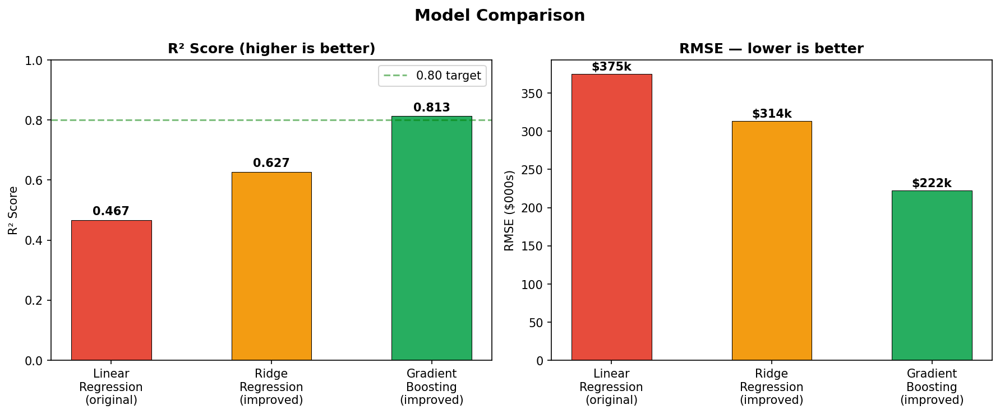
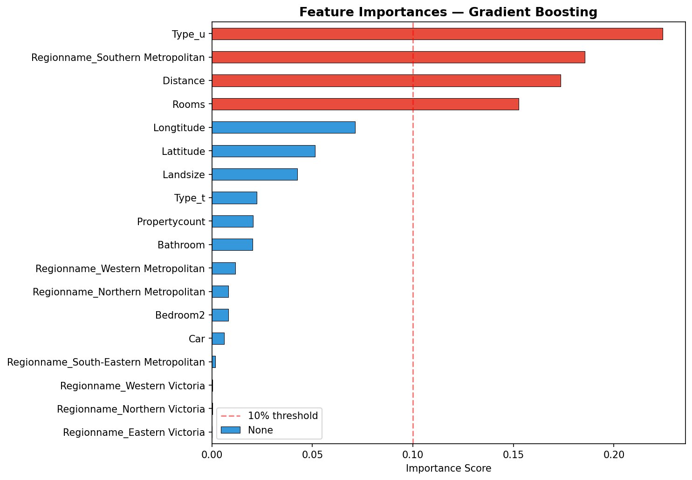
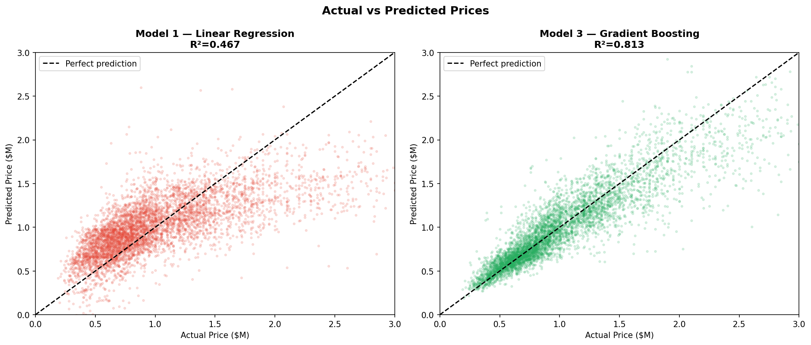
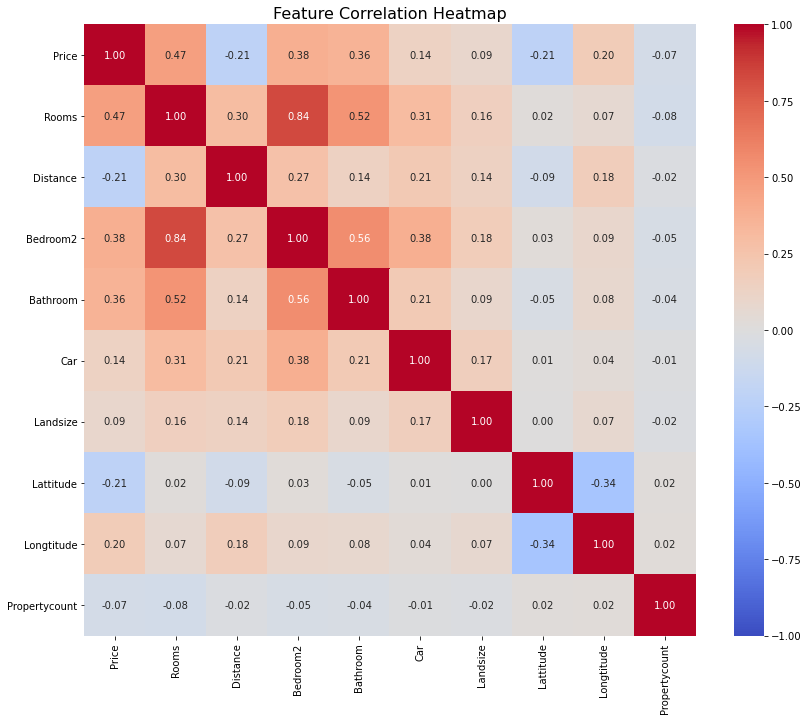

# Melbourne Housing Price Predictor

A machine learning project that predicts Melbourne housing prices using a dataset of 27,000+ real property sales. Improved prediction accuracy from **R² = 0.467 to R² = 0.813** by identifying critical missing features and applying gradient boosting.

---

## Results

| Model | R² Score | RMSE | Features |
|---|---|---|---|
| Linear Regression (baseline) | 0.467 | $374,846 | 6 |
| Ridge Regression | 0.627 | $313,779 | 18 |
| Gradient Boosting | **0.813** | **$222,237** | 18 |

---

## Key Finding

The original model used only 6 numeric features and ignored two of the most important variables:

- **Property type** (house, unit, townhouse) — ranked #1 in feature importance at 22.4%
- **Region** (Southern Metro, Northern Metro, etc.) — ranked #2 at 18.6%

These two missing features alone accounted for **41% of price variation**. The model was essentially trying to price Melbourne properties without knowing what type of property it was or where in Melbourne it was located.

---

## Sample Predictions
```python
3-bed house, 10km from CBD, Southern Metro  →  $1,431,273
Same property as a unit                     →  $921,576
Same house, 30km out, Western Metro         →  $470,022
```

---

## What I Built

- Compared 3 models side by side with consistent evaluation metrics
- Applied log transformation to handle right-skewed price distribution
- One-hot encoded categorical features (Type, Regionname)
- Feature scaling using StandardScaler
- Feature importance analysis to explain model decisions
- Actual vs predicted visualisation to evaluate model quality

---

## Charts

### Model Comparison


### Feature Importance


### Actual vs Predicted


### Correlation Heatmap


---

## Tech Stack

- Python
- pandas
- NumPy
- scikit-learn
- matplotlib
- seaborn

---

## Dataset

Melbourne housing market data sourced from Kaggle (Tony Pino). Contains 34,857 property sales with 21 features including suburb, address, rooms, price, method, seller, date, distance, and property details.

Dataset not included in this repo due to file size. Download from [Kaggle](https://www.kaggle.com/datasets/anthonypino/melbourne-housing-market).

---

## How to Run

1. Clone the repo
```bash
git clone https://github.com/SonaBinuSB/melbourne-housing-price-predictor.git
```

2. Install dependencies
```bash
pip install pandas numpy scikit-learn matplotlib seaborn jupyter
```

3. Download the dataset from Kaggle and place it in the project folder as `Melbourne_housing_FULL.csv`

4. Open the notebook
```bash
jupyter notebook melbourne_housing_analysis.ipynb
```

---

## Project Structure
```
melbourne-housing-price-predictor/
│
├── melbourne_housing_analysis.ipynb  ← main notebook
├── model_comparison.png              ← R² and RMSE comparison chart
├── feature_importance.png            ← top features driving price
├── actual_vs_predicted.png           ← model accuracy visualisation
├── correlation_heatmap.png           ← feature correlation analysis
├── feature_distributions.png        ← distribution of all features
├── scatter_plots.png                 ← feature vs price relationships
├── price_boxplot.png                 ← price distribution after cleaning
└── README.md
```

---
